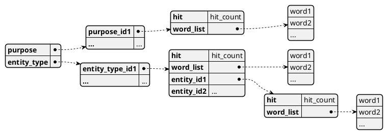
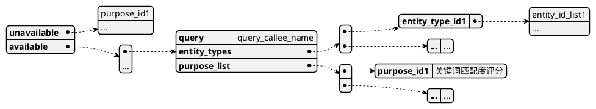
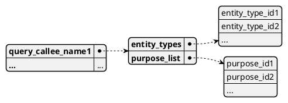
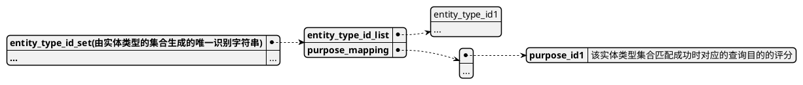
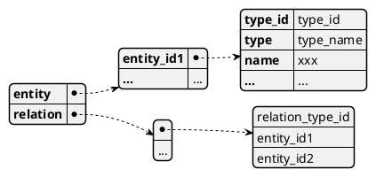
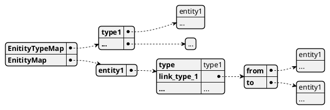
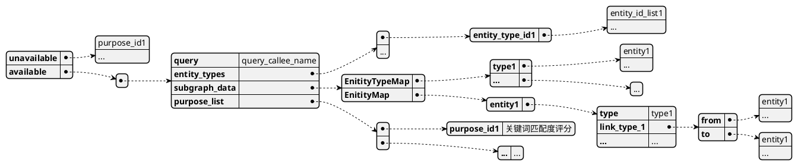
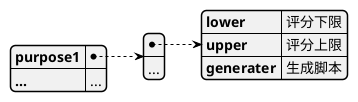

[TOC]
## 整体工作流程及角色分配
```puml
skinparam actorStyle awesome
actor :后台维护: as maintainer
actor :开发人员: as developer
actor :用户: as user
usecase (输入关键词) as keyword 
usecase (识别关键词类别) as keyword_marking
usecase (意图识别及查询映射) as query_mapping
usecase (生成中间数据结构) as data_struct_gen
usecase (页面合成) as page_generate
usecase (浏览页面) as read_page


keyword --> keyword_marking
keyword_marking --> query_mapping
query_mapping --> data_struct_gen
data_struct_gen --> page_generate
page_generate --> read_page

user ..> keyword: 输入关键词
user <.. read_page: 浏览查询结果

maintainer ..> keyword_marking: 维护关键词列表
maintainer ..> query_mapping:   维护查询映射表
developer  ..> query_mapping:   开发新的查询模块
developer  ..> page_generate:   开发新的页面生成模块

```

## 数据处理流程
```puml
start
:输入搜索字符串;

:分词
暂时不做，先要求用户自己用空格分词;

:关键词类型标记
标记关键词的类别，如果有对应的实体则同时记录对应的实体ID;

:意图识别及查询映射
根据关键词类别的集合推断用户的查询意图并映射到相关的查询模块调用;

if(对应查询模块的缓存结果在有效期内) then (Y)
    :调用查询结果缓存;
else (N)
    :生成新查询;
    :查询数据库;
    :缓存查询结果;
endif

:在内存中将查询结果组织成对应的数据结构;

:页面构成识别
根据调用的查询和查询结果，调用相关的页面生成模块;

:页面合成
调用页面生成模块，解读查询结果，合成相关的页面;

:浏览搜索结果;
end

```

### 关键词类型标记
- 关键词的类别分为两个大类，目的指向和实体指向
1. 目的指向：
关键词直接表明用户的搜索目的，例如“怎么测”、“测试”、“测”之类的词，表明了用户想搜索测试方案的内容。目的指向的关键词可以在查询映射时直接映射到查询模块

1. 实体指向：
关键词指向某个实体，例如“LDO”指向了IP实体类型的LDO实体，“Load Regulation”指向了测试项实体类型的负载调整率实体

- 对应的数据表可以这样设计
<table>
<tr>
<th>id</th>
<th>word</th>
<th>target_id</th>
</tr>
<tr>
<td>...</td>
<td>...</td>
<td>...</td>
</tr>
</table>

- 将目的指向的相关记录也作为一种特殊的实体保存，对应的查询模块作为实体的属性保存。查询的sql为
```sql
select 
    entity.id,
    entity.entity_type_id,
    entity.uname,
    entity.cname,
    entity.aname,
    entity.ename,
    _keyword.word
from
    entity inner join 
    (
        select word,target_id
        from keyword
        where word in (关键词列表)
    ) as _keyword
    on entity.id = _keyword.target_id;
```
此处之所以使用inner join是为了统计实体类型及实体的命中率，为意图推断做基础

- 将上述查询的结果保存到下列数据结构中，记为: **keyword_result**
**(此处及之后的json只是用来说明数据结构，实际开发时应设计对应的python class)**


### 意图识别及查询映射

- 意图识别的输入时关键词类型标记输出的数据结构，输出为一个查询模块及参数列表记为**intention_query_list**。数据结构如下：



其中：

unavailable：目的指向的关键字匹配成功，但是对应的实体类型不足，无法执行有效查询的情况。例如，用户只输入了“怎么测”没有输入任何额外的关键字的情况。

available: 可以执行并显示的查询和页面合成列表。注意，此处的“可以”指的是查询的参数完整，不代表有查询结果。例如，用户输入了“怎么测 LDO 输出频率”，能够识别出要查询LDO IP的输出频率测试项如何测试，但该IP没有这个测试项，查询结果为空。

- 数据处理时要的配置数据配合。

1. 查询模块配置记为: **query_callee_config**,其数据结构为：



此配置数据记录了每一个查询模块支持的查询目的和需要的实体类型

2. 实体指向相关记为: **entity_purpose_mapping**，其数据结构为：



此配置数据记录了每一个实体类型的组合和对应的查询目的

- 意图识别的整体执行流程：
```puml
start
    while(遍历keyword_result.entity_type的所有组合)
        if(entity_types的组合entity_purpose_mapping中能在找到purpose)
            :set_purpose.add(purpose);
            :rank_purpose+=匹配成功时的评分;
        endif
    endwhile
    while(遍历keyword_result.purpose)
        :set_purpose.add(purpose);
        :rank_purpose+=hit_count;
    endwhile
    while(遍历set_purpose)
        while(遍历query_callee_config)
            if(purpose_list能找到purpose and keyword_result.entity_type能满足)
                :query_callee_purpose_set[query_callee].add(purpose);
            endif
        endwhile
        :将无法匹配到query_callee的porpose记入unavailable;
    endwhile
    :处理query_callee_purpose_set，用最少的query_callee实现所有的purpose;
    :生成intention_query_list;
end
```

- 查询模块调用

查询模块即intention_query_list.available[i].query的值映射到后端的某个函数调用，例如:“query_ip_testitems”对应到
```python
def query_ip_testitems(ip_id_list:list[int],testitem_id_list:list[int]):
    ...
```
查询的SQL可以借助with语句一次性的把实体和关系查询出来，例如：
```sql
with
    ip as (
        select * from entity where id = 5
    ),
    ip_item as (
        select * from relation 
        where 
            entity_id in (select id from ip)
            and
            relation_type_id = 4
    ),
    item as (
        select * from entity
        where
            id in (select sub_id from ip_item)
    ),
    item_card as (
        select * from relation
        where
            entity_id in (select id from item)
            and
            relation_type_id = 6
    ),
    card as (
        select * from entity
        where
        id in (select sub_id from item_card)
    )

    select
        item.id as entity_id,
        item.uname as entity_uname,
        -1 as relation_id,
        -1 as relation_entity_id,
        -1 as relation_sub_id
    from item

union

    select
        card.id as entity_id,
        card.uname as entity_uname,
        -1 as relation_id,
        -1 as relation_entity_id,
        -1 as relation_sub_id
    from card

union

    select
        -1 as entity_id,
        '' as entity_uname,
        item_card.id as relation_id,
        item_card.entity_id as relation_entity_id,
        item_card.sub_id as relation_sub_id
     from item_card
;
```

传入绑定指定的参数，intention_query_list.available[i].entity_types后
该函数调用后输出如下的数据结构，记为: **subgraph_raw_data**:



### 中间数据结构生成

intention_query_list中每一个query_callee和entity_type、entity组合的查询结果subgraph_raw_data记录在一个缓存表中，并配合时间戳管理有效期。


subgraph_raw_data从缓存中获取或者查询得出后，生成最终的中间数据**subgraph_data**，具体数据格式如下:



具体参考之前共享<b>minigraph.py</b>

- 将生成的subgraph_data与intention_query_list合并，生成如下数据结构记为**intentiaon_query_result**：



### 页面合成

- 引入purpose和页面视图的配置数据记为: **purpose_page_generate_config**， 数据结构为：



minigraph
```puml
hide empty description
state ip1
state item1
state method1
state method2
state method3
state config1
state config2
state usage1
state usage2
state usage3
state solution1
state solution2
state solution3
state code1
state code2
state code3
state code4
ip1-->item1
ip1-->config2
ip1-->config1
item1-->config2
item1-->config1
item1-->method2
item1-->method1
item1-->method3
method1-->solution1
method2-->solution2
method3-->solution3
config1-->usage2
config1-->usage1
config2-->usage3
usage1-->solution1
usage2-->solution2
usage3-->solution3
solution1-->code4
solution1-->code1
solution2-->code2
solution3-->code3
```

Process finished with exit code 0
